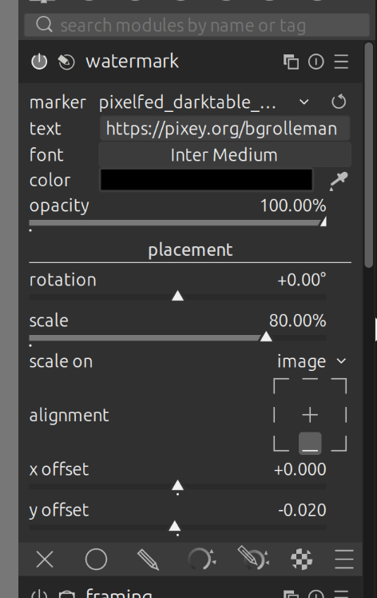

# Pixelfed-DarkTable-Watermark
SVG Watermarks for Darktable to promote Pixelfed

Created a simple SVG so when I upload to the big tech socials people know where the original can be found. 

1. Copy to ~/.config/darktable/watermarks
2. Add to image
3. Update text to match your pixelfed profile
4. Align

